<div align="center">

<!-- ═══════════════ ANIMATED HEADER (self-hosted SVG — loads 100% reliably, no third-party API) ═══════════════ -->



<br/><br/>

<!-- ═══════════════ CONTACT BADGES ═══════════════ -->

<a href="https://daudrazzaq.me"></a>
<a href="https://linkedin.com/in/daud-razzaq-3a3892233"></a>
<a href="mailto:daudrazzaq7890@gmail.com"></a>

</div>

<br/>

<!-- ═══════════════ ABOUT ═══════════════ -->

## 🚀 About Me

```typescript
const daud = {
  role: "Mobile & Frontend Engineer",
  experience: "3.5+ years · 3+ product companies + freelance for global clients",
  location: "Riyadh, Saudi Arabia 🇸🇦",

  code: ["TypeScript", "JavaScript", "Python", "SQL"],
  mobile: ["React Native", "Expo", "Native Modules", "Store Releases"],
  web: ["Next.js", "React", "Tailwind", "Framer Motion", "SEO-first builds"],
  ai: ["LLM Chatbots (Gemini)", "Computer Vision (OpenCV, MediaPipe)", "Whisper", "PyTorch"],

  shipped: "20+ products for clients in USA, UK, UAE, Canada & Australia",

  certifications: ["Meta React Native Specialization", "IBM Front-End with React"],
  education: "B.S. Software Engineering — COMSATS University (2021–2025)",
};
```

- 🔭 **Freelance Full-Stack Web &amp; Mobile Developer** — delivering end-to-end for clients across the US, UK, UAE, Canada &amp; Australia
- 🤖 Deep in **AI-integrated products**: LLM chatbots, emotion detection, speech transcription pipelines
- 🌙 Obsessed with **premium UI/UX** — glassmorphism, 60fps Reanimated transitions, dark-mode design systems
- ⚡ Performance focused: **100/100 Lighthouse SEO**, latency reduction, Core Web Vitals
- 🇸🇦 **Open to on-site roles in Riyadh** — available on short notice

<br/>

<!-- ═══════════════ TECH STACK ═══════════════ -->

## 🛠️ Tech Arsenal

<div align="center">

### 📱 Mobile

    

### 🌐 Web / Frontend

    

### 🤖 AI &amp; Emerging Tech

     

### ⚙️ Backend &amp; Cloud

     

### 🚀 Infrastructure &amp; DevOps

    

</div>

<br/>

<!-- ═══════════════ FEATURED PROJECTS ═══════════════ -->

## 📌 Featured Projects

<table>
<tr>
<td width="50%" valign="top">

### 🏪 WholesaleEZ
**B2B Commerce &amp; Inventory Platform — LIVE IN PRODUCTION**

Enterprise-grade wholesale marketplace: RBAC for suppliers/vendors/warehouses, multi-warehouse real-time inventory, QuickBooks financial sync, secure payments &amp; automated PDF invoicing.

`React Native` `TypeScript` `Django` `Redux/Zustand` `QuickBooks API`

<a href="https://apps.apple.com/my/app/wholesale-ez/id1592556878"></a> <a href="https://play.google.com/store/apps/details?id=wholesaleez.wholesaleezapp.supplierapp"></a>

</td>
<td width="50%" valign="top">

### 🌍 ZolMarket
**Bilingual English/Arabic Marketplace (MENA)**

Fully bilingual EN/AR classifieds with right-to-left (RTL) layouts — moderated listings, in-chat price negotiation, seller reputation, and Stripe-powered featured ads.

`React Native` `TypeScript` `Firebase` `Stripe` `Cloudflare R2`

<a href="https://daudrazzaq.me/work/zolmarket"></a>

</td>
</tr>
<tr>
<td width="50%" valign="top">

### 🔮 Ethereya
**AI Wellness App with Premium Subscriptions**

Subscription-based AI guidance app: LLM-generated personalized reports, conversational AI chatbot with file uploads, glassmorphic UI with fluid Reanimated transitions.

`React Native` `TypeScript` `TanStack Query` `Reanimated` `LLM`

<a href="https://daudrazzaq.me/work/ethereya"></a>

</td>
<td width="50%" valign="top">

### 🎯 AI Interview Facilitator
**Computer Vision + LLM Interview Platform**

AI mock-interview system: Gemini-tailored questions from resume parsing, Whisper speech transcription, MediaPipe emotion/non-verbal analysis → objective evaluation reports. ~95% expression-recognition accuracy.

`React Native` `Python` `Gemini` `Whisper` `MediaPipe` `PyTorch`

<a href="https://daudrazzaq.me/work/ai-interview-facilitator"></a>

</td>
</tr>
<tr>
<td width="50%" valign="top">

### 🏛️ Aureon Studio — *Client Project*
**SEO-First Production Website — LIVE**

Designed and developed the production Next.js website for a London interior-architecture firm: structured data, fluid Framer Motion animations, enquiry + WhatsApp conversion flow. **100/100 Lighthouse SEO.**

`Next.js` `React` `Framer Motion` `Vercel` `Resend`

<a href="https://aureonstudio.co.uk"></a>

</td>
<td width="50%" valign="top">

### 🍽️ Meal Mate
**AI Food &amp; Nutrition App**

Snap a photo → instant meal identification and nutrition breakdown. AI recipe generation from your pantry, calorie tracking, streaks &amp; grocery lists. Vision backend in FastAPI + PyTorch.

`React Native` `TypeScript` `Python` `FastAPI` `PyTorch`

<a href="https://daudrazzaq.me/work/meal-mate"></a>

</td>
</tr>
</table>

<div align="center">

**➕ More projects:** TrendUp (Web3 social) · Cleaners Choice (on-demand services) · Luci (booking marketplace, EN/TH) · Cafena (Next.js e-commerce)

<a href="https://daudrazzaq.me/work"></a>

</div>

<br/>

<!-- ═══════════════ EXPERIENCE ═══════════════ -->

## 💼 Experience

| | Role | Company | Period |
|---|---|---|---|
| 🟢 | **Freelance Full-Stack Developer** | Independent — Web &amp; Mobile · Global Clients (US, UK, UAE, CA, AU) | 2021 – Present |
| 🔵 | **Mobile Application Developer** | Webexhaust — Remote | Oct 2025 – Jun 2026 |
| 🔵 | **Mobile Application Developer** | 7 Kings Code — Lahore | Mar 2025 – Sep 2025 |
| 🔵 | **Mobile Application Developer** | Wise360 Solutions — Abbottabad *(cut app load times ~30%)* | Feb 2023 – Mar 2025 |

<br/>

<!-- ═══════════════ CERTIFICATIONS ═══════════════ -->

## 📜 Certifications

<div align="center">

<a href="https://coursera.org/verify/specialization/DS8NWQGQNBAB"></a>

<a href="https://coursera.org/verify/WTJPNLAKXVDM"></a>

<a href="https://coursera.org/verify/MLHJ3WLFKJGP"></a>


</div>

<br/>

---

<!-- ═══════════════ FOOTER / CTA ═══════════════ -->

<div align="center">

## 🤝 Let's Build Something World-Class

**🇸🇦 Actively seeking Senior Mobile Development  / Next.js roles in Riyadh**

Fluent in **English** &amp; **Urdu** · Arabic-market product experience · Available on short notice

<br/>

<a href="https://daudrazzaq.me/contact"></a>
<a href="mailto:daudrazzaq7890@gmail.com"></a>

<br/><br/>

⭐ *If my work interests you, check out* **[daudrazzaq.me](https://daudrazzaq.me)** *for live demos*

<!-- ═══════════════ ANIMATED FOOTER (self-hosted SVG) ═══════════════ -->


</div>
